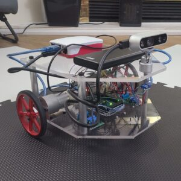

# Project Files for Autonomous Robot

This repository is for the purpose of sharing files for my autonomous robot using Visual SLAM project. To learn more about the project and view demos, please visit the Project Page: [Autonomous Robot using Visual SLAM](https://www.aliasghar.tech/home/robot/)

## What is in this repository?
1. `base_controller.ino` is an arduino sketch which was uploaded to the Arduino Mega. It is essentially a ROS Serial Node (must install ROS Serial library). The node listens to the `cmd_vel` topic and issues PWM signals to the motor controllers used by the differential drive robot.
2. `tf_broadcaster.cpp` is a ROS node that published the transform from the camera's origin to the robot's origin, essential for odometry and working with ROS's navigation stack
3. `synced_rgbd.launch` is used to launch the following nodes/launch files on the robot's Raspberry Pi 4:
  > - `rs_rgbd.launch` to start published sensor data from the Inter RealSense D435 RGBD sensor
  > - `rgbd_sync` node along with a nodelet manager to synchronize and compress the RGB and Depth data before publishing over the network
  > - `rosserial` node
  > - `tf_broadcaster` node to braodcast the transfrom from camera_link to base_link to odom for navigation
4. The `/ros_robot` folder contains the necessary files that are required for running Visual SLAM and Autonomous Navigation on the remote computer. Simply launch the `SLAM_with_teleop.launch` to start mapping an environment or `autonomous_navigation.launch` to issue goals to the robot (will need to launch RVIZ seperately) from the remote computer **after** launching the `synced_rgbd.launch` file on the robot. 
